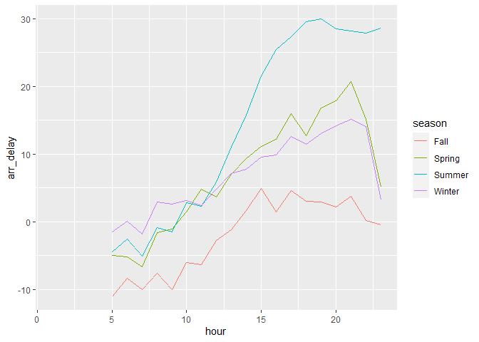
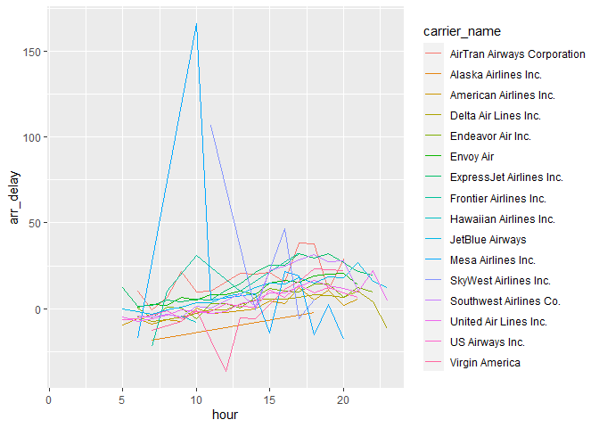
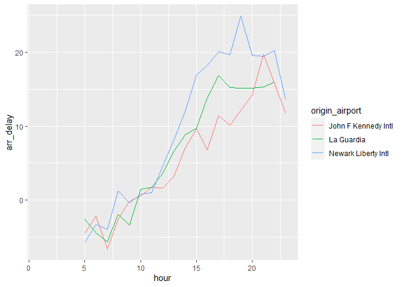

STAT 433 HW2
================
2022-10-11

# The following work are completed by Fenghang Yao(<fyao4@wisc.edu>).

[Fenghang Yao HW2 Github
link](https://github.com/dorisyao06/STAT-433-HW2)

## Introduction

In this assignment, I want to find out what time of day should people
fly if people want to avoid delays as much as possible. To make this
topic more interesting, I also digged into the question that does this
choice depend on other factors like Season, Weather, Airport, and
Airline. The datasets I used are in nycflights13 package.

### Findings

1.  When consider season as a factor, I found out that in Spring,
    Summer,and Winter, 7 am is the time people want to fly if people
    want to avoid arrival delays as much as possible. In Fall, 5am is
    the time people want to choose to fly if people want to avoid
    arrival delay.
2.  When consider airline as a factor, the pattern I found out are list
    below section in details, some of them are if people choose to take
    Virgin America airline in nyc in 2013, people should choose to fly
    at 12pm to avoid arrival delays as much as possible. if people
    choose to take American Airlines, people should choose to fly at 5am
    to avoid arrival delays as much as possible.
3.  When consider airport as a factor, people depart at John F Kennedy
    Intl(JFK) airport should choose to fly at 7am, peopel depart at
    Newark Liberty Intl(EWR) should choose to fly at 5am, people depart
    at La Guardia(LGA) airport should choose to fly at 7am to avoid
    arrival delays as much as possible.

## Codes for Findings

### Season

In this assignment, month 1,2,11,12 are seen as winter, month 3 to 5 are
seen as Spring,month 6 to 8 are seen as Summer, month 9 to 10 are seen
as Fall.

``` r
flights_season = flights %>% mutate(season = case_when(month %in% c(6:8) ~ "Summer",
                                             month %in% c(9:10) ~ "Fall",
                                             month %in% c(1:2,11:12) ~ "Winter",
                                             month %in% c(3:5) ~  "Spring"))
```

After adding the season column, I used group_by function to first group
hour and season factor, and using summarise function to get the mean
arrival delay time for each hour-season combination group, and also used
arrange function to list the least arrival delay time at first.

``` r
flights_season_hour = flights_season %>%group_by(hour,season) %>%
  summarise(arr_delay = mean(arr_delay, na.rm = TRUE)) %>%
  arrange(arr_delay)
```

Then, I want to create a linear plot to show the relationship between
hour and arrival delay time(in minutes) based on season classification.

``` r
ggplot(flights_season_hour, aes(hour, arr_delay, color = season)) +
  geom_line(na.rm = T) 
```

<!-- -->

In the following step, I want to see, for each season, which hour has
the least arrival delay time.

``` r
flights_season_hour= flights_season_hour %>% group_by(season) %>% filter(arr_delay == min(arr_delay,na.rm = T))
flights_season_hour
```

    ## # A tibble: 4 × 3
    ## # Groups:   season [4]
    ##    hour season arr_delay
    ##   <dbl> <chr>      <dbl>
    ## 1     5 Fall      -11.0 
    ## 2     7 Spring     -6.66
    ## 3     7 Summer     -5.13
    ## 4     7 Winter     -1.85

According to the above table, we could see that in
<mark style="background-color: #FFFF00">Fall</mark> season,
<mark style="background-color: #FFFF00">5am</mark> is the time of the
day people should choose to fly if they want to avoid arrival delay as
much as possible; for <mark style="background-color: #FFFF00">Spring,
Summer and Winter</mark>,
<mark style="background-color: #FFFF00">7am</mark> is the time of the
day people should choose to fly if they want to avoid arrival delay as
much as possible.

### Airline

I first added a column to flights dataframe called “carrier_name”, which
represent the whole airline name of the carrier. The translation is
based on airlines dataframe.

``` r
flights$carrier_name <- airlines$name[match(flights$carrier, airlines$carrier)]
```

After adding the carrier_name column, I used group_by function to first
group hour and carrier_name, and using summarise function to get the
mean arrival delay time for each hour-carrier_name combination group,
and also used arrange function to list the least arrival delay time at
first.

``` r
flights_airline_hour = flights %>%group_by(hour,carrier_name) %>%
  summarise(arr_delay = mean(arr_delay, na.rm = TRUE)) %>%
  arrange(arr_delay)
```

Next we want to know how many unique airlines in carrier_name column in
flights dataframe. And runing the code below, we can see there are
sixteen unique airlines in nyc in 2013, and we will expect a pattern
that will list <mark style="background-color: #FFFF00">16
airlines</mark> and the time that people should choose to fly at each
airports.

``` r
unique(flights$carrier_name)
```

    ##  [1] "United Air Lines Inc."       "American Airlines Inc."     
    ##  [3] "JetBlue Airways"             "Delta Air Lines Inc."       
    ##  [5] "ExpressJet Airlines Inc."    "Envoy Air"                  
    ##  [7] "US Airways Inc."             "Southwest Airlines Co."     
    ##  [9] "Virgin America"              "AirTran Airways Corporation"
    ## [11] "Alaska Airlines Inc."        "Endeavor Air Inc."          
    ## [13] "Frontier Airlines Inc."      "Hawaiian Airlines Inc."     
    ## [15] "Mesa Airlines Inc."          "SkyWest Airlines Inc."

Then, I want to create a linear plot to show the raltionship between
hour and arrival delay time(in minutes) based on airlines
classification.

``` r
ggplot(flights_airline_hour, aes(hour, arr_delay, color = carrier_name)) +
  geom_line(na.rm = T) 
```

<!-- -->

In the following step, I want to see, for each carrier, which hour has
the least arrival delay time.

``` r
flights_airline_hour= flights_airline_hour %>% group_by(carrier_name) %>% filter(arr_delay == min(arr_delay,na.rm = T))
flights_airline_hour
```

    ## # A tibble: 16 × 3
    ## # Groups:   carrier_name [16]
    ##     hour carrier_name                arr_delay
    ##    <dbl> <chr>                           <dbl>
    ##  1    12 Virgin America                -36.3  
    ##  2     7 Frontier Airlines Inc.        -22    
    ##  3     7 Alaska Airlines Inc.          -18.2  
    ##  4    20 Mesa Airlines Inc.            -17.8  
    ##  5    23 Delta Air Lines Inc.          -11.4  
    ##  6     5 American Airlines Inc.         -9.68 
    ##  7    10 Hawaiian Airlines Inc.         -7.94 
    ##  8     6 United Air Lines Inc.          -7.52 
    ##  9     5 US Airways Inc.                -6.40 
    ## 10    10 Endeavor Air Inc.              -6.07 
    ## 11    17 SkyWest Airlines Inc.          -6    
    ## 12     7 Southwest Airlines Co.         -4.71 
    ## 13     7 JetBlue Airways                -3.03 
    ## 14     7 AirTran Airways Corporation    -0.690
    ## 15     6 Envoy Air                       1.13 
    ## 16     6 ExpressJet Airlines Inc.        1.47

According to above table, we can see the expected pattern. I won’t list
all 16 cases because the details are in the above table for reference.
But for example if people choose to take
<mark style="background-color: #FFFF00">Virgin America airline</mark> in
nyc in 2013, people should choose to fly at
<mark style="background-color: #FFFF00">12pm</mark> to avoid arrival
delays as much as possible. if people choose to take
<mark style="background-color: #FFFF00">American Airlines</mark>, people
should choose to fly at
<mark style="background-color: #FFFF00">5am</mark> to avoid arrival
delays as much as possible.

### Airport

Next I added a column to flights dataframe called “origin_airport”,
which represent the whole airport name of the origin. The translation is
based on airports dataframe.

``` r
flights$origin_airport <- airports$name[match(flights$origin, airports$faa)]
```

After adding the origin_airport column, I used group_by function to
first group hour and origin_airport, and using summarise function to get
the mean arrival delay time for each hour-origin_airport combination
group, and also used arrange function to list the least arrival delay
time at first.

``` r
flights_airports_hour = flights %>%group_by(hour,origin_airport) %>%
  summarise(arr_delay = mean(arr_delay, na.rm = TRUE)) %>%
  arrange(arr_delay)
```

Next we want to know how many unique airports in origin column in
flights dataframe. And runing the code below, we can see there are three
unique airports in nyc in 2013, and we will expect a pattern that will
list <mark style="background-color: #FFFF00">3 airports</mark> and the
time that people should choose to fly at each airports.

``` r
unique(flights$origin)
```

    ## [1] "EWR" "LGA" "JFK"

Then, I want to create a linear plot to show the raltionship between
hour and arrival delay time(in minutes) based on origin airports
classification.

``` r
ggplot(flights_airports_hour, aes(hour, arr_delay, color = origin_airport)) +
  geom_line(na.rm = T) 
```

<!-- -->

In the following step, I want to see, for each origin airport, which
hour has the least arrival delay time.

``` r
flights_airports_hour= flights_airports_hour %>% group_by(origin_airport) %>% filter(arr_delay == min(arr_delay,na.rm = T))
flights_airports_hour
```

    ## # A tibble: 3 × 3
    ## # Groups:   origin_airport [3]
    ##    hour origin_airport      arr_delay
    ##   <dbl> <chr>                   <dbl>
    ## 1     7 John F Kennedy Intl     -6.58
    ## 2     5 Newark Liberty Intl     -5.75
    ## 3     7 La Guardia              -5.67

According to above table, we can see the expected pattern.If people
depart at <mark style="background-color: #FFFF00">John F Kennedy Intl
(JFK) airport</mark>, people should choose to fly at
<mark style="background-color: #FFFF00">7am</mark> to avoid delays as
much as possible.If people depart at
<mark style="background-color: #FFFF00">Newark Liberty Intl (EWR)
airport</mark>, people should choose to fly at
<mark style="background-color: #FFFF00">5am</mark> to avoid delays as
much as possible.If people depart at
<mark style="background-color: #FFFF00">La Guardia (LGA) airport</mark>,
people should choose to fly at
<mark style="background-color: #FFFF00">7am</mark> to avoid delays as
much as possible.
